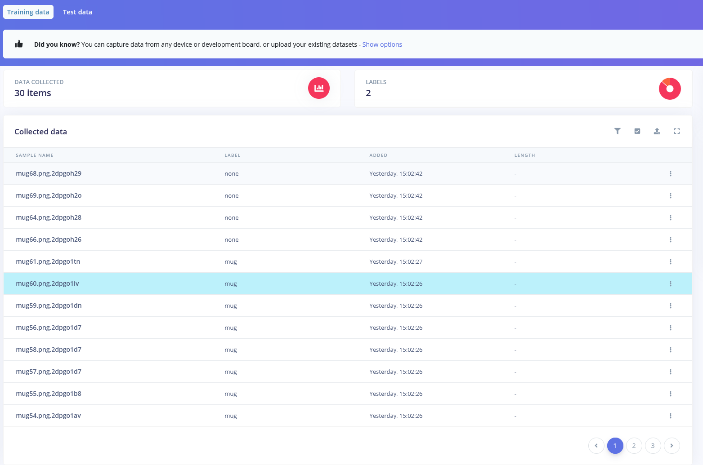
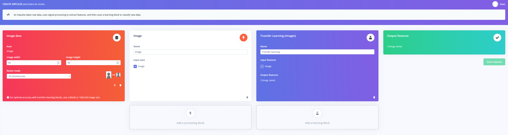
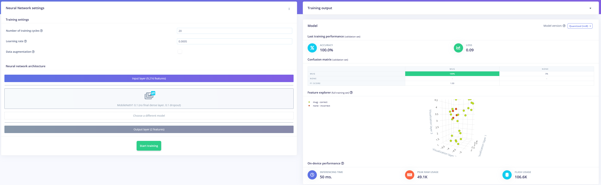
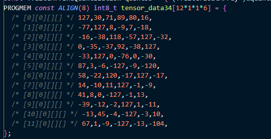

# Teensy MicroMod Edge Impulse Demo

## Table of contents

- [Teensy MicroMod Edge Impulse Demo](#teensy-micromod-edge-impulse-demo)
  - [Table of contents](#table-of-contents)
  - [General description](#general-description)
  - [Setting up hardware](#setting-up-hardware)
  - [Gathering images](#gathering-images)
  - [Using Edge Impulse](#using-edge-impulse)
  - [Seeing the results](#seeing-the-results)
  - [Wrapping up](#wrapping-up)

## General description

This project is a simple launch-point for makers who want to use the [Sparkfun Teensy MicroMod processor](http://www.sparkfun.com/products/16402) with the [Sparkfun MicroMod Machine Learning Carrier board](http://www.sparkfun.com/products/16400). It requires an [ILI9341 TFT screen](https://www.amazon.com/HiLetgo-240X320-Resolution-Display-ILI9341/dp/B073R7BH1B/ref=sr_1_3?dchild=1&keywords=ili9341&qid=1629919338&sr=8-3), [HM01B0 camera module](https://www.sparkfun.com/products/15570), and MicroSD card, along with the previously mentioned Sparkfun components. There are two custom-designed stands for the screen and carrier board within [this folder](3D%20printable%20files/).

If you haven't already installed [Teensyduino](https://www.pjrc.com/teensy/td_download.html), please do so before continuing.

## Setting up hardware

To start, connect the camera module to the CMOS camera connector on the top of the carrier board facing up. Next, slot in the MicroSD card into the appropriate slot and then attached jumper wires as follows:

| Carrier board |    TFT     |
| :-----------: | :--------: |
|      SCK      |    SCK     |
|     COPI      | SDI (MOSI) |
|     CIPO      | SDO (MISO) |
|      TX1      |     DC     |
|      RX1      |   RESET    |
|      D1       |    LED     |
|      D0       |     CS     |
|      3V3      |    VCC     |
|      GND      |    GND     |

Once the Teensy processor board has been slotted into the M.2 connector on the carrier board, it's time to gather some images.

## Gathering images

Collecting images is super easy. First, add the [HM01B0 library](TMM-HM01B0/) (which I found [here](https://github.com/mjs513/TMM-HB01B0-Camera)) to the Arduino IDE by including it as a folder and then open up the [example sketch](TMM-HM01B0/examples/HM01B0_ML_example/HM01B0_ML_example.ino) and upload it. With the serial monitor open, position whatever item you want to classify in front of the camera and then send the `b` character to save an image to the MicroSD card. For a live preview, you can start and stop it with the `V` character.

## Using Edge Impulse

The collected images can be uploaded to the [Edge Impulse Studio](https://www.edgeimpulse.com/) via the data upload page. Simply select all of the images that contain the desired object and give them a label. Everything should appear on the `Data acquisition` page.

I set up my impulse with an Image data block and image processing block that take in 96x96px images and produce an array of floating-point numbers which are used to train the model.

A transfer learning MobileNetV1 base model was chosen due to its small memory footprint. It ended up being 100% accurate with a loss of only 0.09, as well as running in 50ms while consuming 49.1KB of RAM and 106.6KB of flash.

You can find the public version of my [Edge Impulse project here](https://studio.edgeimpulse.com/public/46179/latest).

## Seeing the results

I deployed my model as an Arduino library and promptly added it to the IDE. The [included code](MicroMod_Image_Classification/) is pretty basic. It configures the camera, sets up a few buffers, and initializes the LCD. Within the main `loop`, the `frameBuffer` is filled with a frame from the camera, which is then used to draw the image on the LCD. Next, it gets resized to 96 by 96 pixels with a crude nearest-neighbor algorithm and converted to the aforementioned array of `float`s. Finally, this data is passed to the inferencing algorithm via an `ei::signal_t` object and read from an `ei_impulse_result_t` object. The classification with the highest confidence is written to the LCD on top of the image.

As a quick note, sometimes the model might be too large to fit within the Teensy's RAM, at which point it becomes necessary to store some of the larger model weight arrays in `PROGMEM` (flash) storage.

## Wrapping up

This project is merely for getting started with the above hardware. Feel free to explore, modify the code, and expand the project even further. You can also try cloning the [Edge Impulse project](https://studio.edgeimpulse.com/public/46179/latest) and adding some new data for increased flexibility and accuracy.
